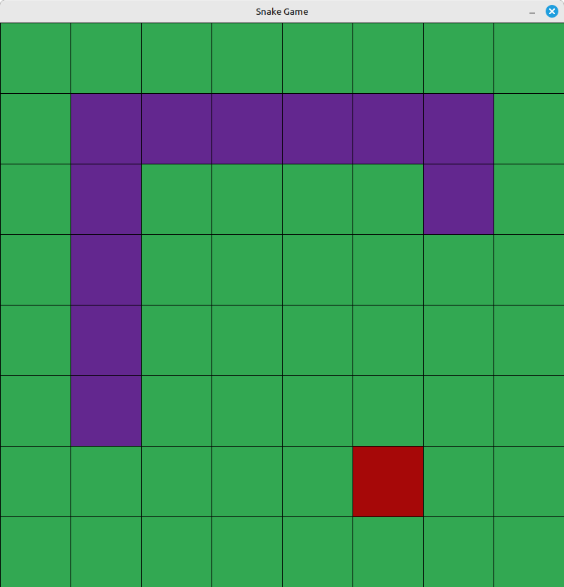

# SnakeGameSDL

The intention of this repository is to gain familiarity with the SDL library and to more diligently follow a software development life cycle with a small-scale project. This includes implementing best practices, software design and development, creating bug reports, project management and testing via Pytest. 

Given that this project is a game, it is also meant to an amusing project to be shared with friends.

## How to Install:
_Under construction..._

## How to Play:
1. Use the arrows keys (`←` `↑` `→` `↓`) to control the direction of travel of the snake. Quit the game at any time by pressing `q`.
2. Attempt to eat the apples by moving the head of the snake over top of the apple.
3. Each time an apple is eaten, a new apple will appear, the snake will grow and so will your score.
4. Try to get a high score without crashing into the walls or with yourself!

#
